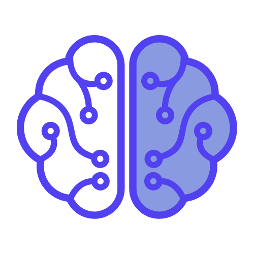

# 🧠 MiniMind

**Big Questions, Little Answers.**  
MiniMind is an AI-powered app designed to help kids and parents explore the world's most curious questions—together. Ask a big question, and get three fun, age-appropriate explanations: one for kids, one for parents, and one just for fun.




---

## ✨ Features

- 🧒 **Kid-Friendly Answers**: Simplified explanations designed to spark curiosity and imagination.
- 👨‍👩 **Parent Insights**: Deeper, contextual responses to support learning and conversation.
- 💡 **Fun Thought**: A whimsical or thought-provoking twist for both generations to enjoy.
- 💬 **AI-Powered**: Powered by OpenAI (or similar) to generate contextual, personalized content.
- 🎨 **Delightful UI**: Built with Framer Motion for smooth animations and a playful, responsive design.
- ⏳ **Dynamic Thinking Messages**: Fun, rotating "thinking" prompts while responses load.

---

## 🚀 Getting Started

### Prerequisites

- Node.js 18+
- A running backend endpoint at `/api/explain` that accepts:
  ```json
  {
    "topic": "string"
  }
  ```
  And returns:
  ```json
  {
    "kid": "string",
    "parent": "string",
    "fun": "string"
  }
  ```

### Installation

```bash
git clone https://github.com/yourusername/minimind.git
cd minimind
npm install
npm run dev
```

Visit `http://localhost:3000` to start asking questions!

---

## 🧩 Tech Stack

- **React + Next.js (App Router)**
- **Tailwind CSS**
- **Framer Motion** – for subtle animations
- **Lucide Icons** – used for the heart icon
- **Custom Fonts** – Kid- and parent-themed typography

---

## ✍️ File Structure

```
/app
  /page.tsx         – Main UI logic
/public
  /mmlogo.png        – Logo used in header
/api
  /explain.ts        – (You provide) Serverless endpoint to handle AI logic
```

---

## 💡 Example Prompt

> **"What is a black hole?"**

- 🧒 *For Kids*: "A black hole is like a space vacuum cleaner that even light can't escape from!"
- 👨‍👩 *For Parents*: "A region of spacetime where gravity is so strong, not even light can escape—predicted by Einstein’s theory of relativity."
- 💡 *Fun Thought*: "If you fell into a black hole, time might feel really weird... like slow motion forever!"

---

## 🧠 Why MiniMind?

Because learning is more fun together. MiniMind bridges the gap between wonder and wisdom for kids and their grownups—one question at a time.

---

## 👤 Author

Built with ❤️ by [Jon](https://x.com/JontheNerd_)
